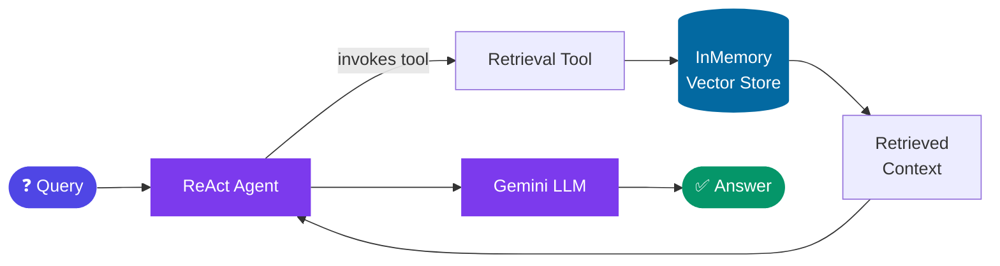
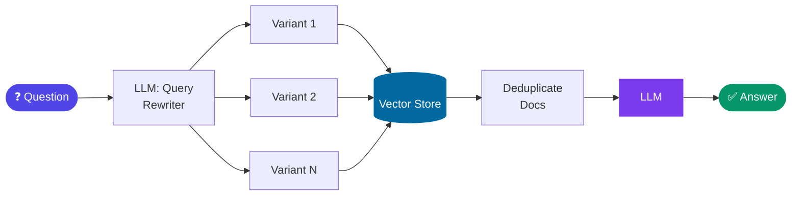
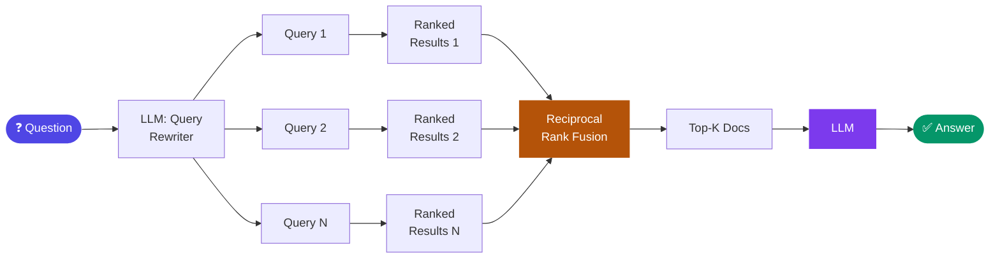
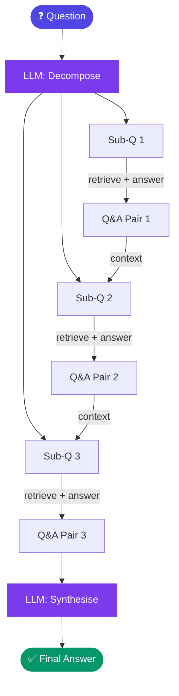
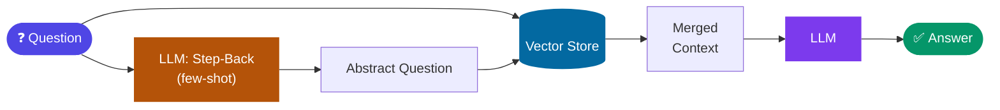
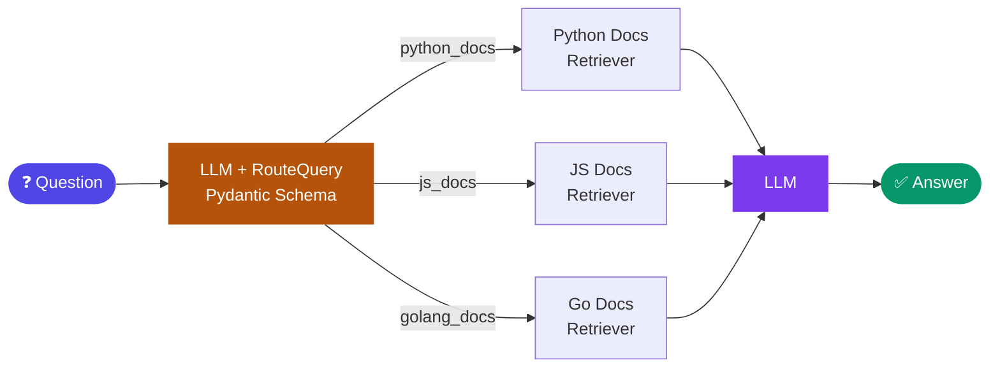
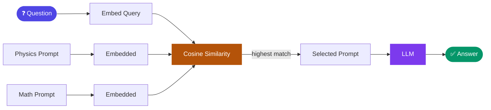
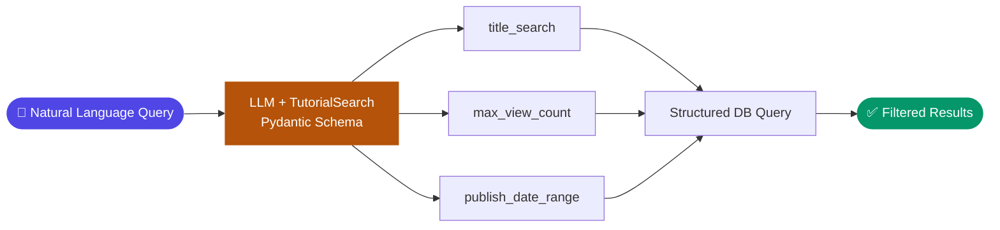
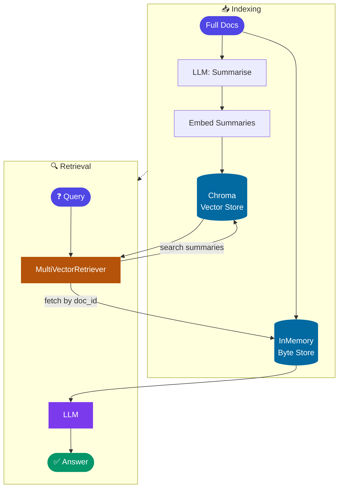

# RAG from Scratch

A hands-on exploration of **Retrieval-Augmented Generation (RAG)** pipelines using [LangChain](https://python.langchain.com/) and Google Gemini — progressing from a bare-bones retrieval chain all the way to advanced indexing and query strategies.

Each notebook is self-contained and teaches a distinct RAG concept, making this a useful reference when learning or evaluating different retrieval approaches.

---

## Notebooks at a glance

| # | Notebook | Topic | Complexity |
|---|----------|-------|------------|
| 1 | [`main.ipynb`](#1-mainipynb--classic-rag-chain) | Classic RAG chain with Chroma | ⭐ Beginner |
| 2 | [`rag_basic.ipynb`](#2-rag_basicipynb--agent-based-rag) | Agent-based RAG with a retrieval tool | ⭐⭐ Beginner–Intermediate |
| 3 | [`rag_query_transformations.ipynb`](#3-rag_query_transformationsipynb--query-transformations) | Multi-query, RAG-Fusion, Decomposition, Step-Back, HyDE | ⭐⭐⭐ Intermediate–Advanced |
| 4 | [`rag_routing.ipynb`](#4-rag_routingipynb--query-routing) | Logical routing & semantic routing | ⭐⭐⭐ Intermediate–Advanced |
| 5 | [`rag_multi_representation_indexing.ipynb`](#5-rag_multi_representation_indexingipynb--multi-representation-indexing) | Summary-based multi-vector indexing | ⭐⭐⭐⭐ Advanced |

All notebooks use Lilian Weng's [LLM Powered Autonomous Agents](https://lilianweng.github.io/posts/2023-06-23-agent/) blog post as their primary source document.

---

## Notebook deep dives

### 1. `main.ipynb` — Classic RAG Chain

> **The foundation.** Load a webpage, split it into chunks, embed and store with Chroma, then retrieve and answer using Gemini.

**Pipeline:**


**Key concepts:**
- Document loading with `WebBaseLoader`
- Chunking strategy with `RecursiveCharacterTextSplitter`
- Embedding with `GoogleGenerativeAIEmbeddings`
- Persistent vector storage with `ChromaDB`
- A composable RAG chain using LangChain Expression Language (LCEL)

---

### 2. `rag_basic.ipynb` — Agent-Based RAG

> **Adding agency.** Wraps the retriever as a tool and gives an LLM agent control over when and how to retrieve.

**Pipeline:**



**Key concepts:**
- In-memory vector store for fast prototyping
- Wrapping a retriever as a LangChain `Tool`
- Constructing a ReAct-style agent with `create_react_agent`
- Contrasts rule-based retrieval (chain) vs. agent-directed retrieval

---

### 3. `rag_query_transformations.ipynb` — Query Transformations

> **The biggest notebook.** Five distinct techniques that transform the user's query before (or during) retrieval to improve answer quality.

#### 3a. Multi-Query
The original question is rewritten into **multiple alternative phrasings** using an LLM. Each variant is sent to the retriever independently, and the union of results provides richer context.



#### 3b. RAG-Fusion
Extends multi-query by applying **Reciprocal Rank Fusion (RRF)** to re-rank the retrieved documents across all query variants before passing context to the LLM — producing a single, high-quality ranked list.



#### 3c. Decomposition
The question is broken down into **independent sub-questions**. Each sub-question is answered sequentially, with prior Q&A pairs fed as context to later sub-questions — effectively chaining knowledge.



#### 3d. Step-Back Prompting
Uses few-shot examples to generate a **more abstract, generalised version** of the question. Both the original and step-back questions are used for retrieval, combining specific and broad context.



#### 3e. HyDE (Hypothetical Document Embeddings)
Instead of embedding the raw question, the LLM first **generates a hypothetical answer passage**. That passage is embedded and used for retrieval — exploiting the semantic proximity between a "fake" answer and real documents.


---

### 4. `rag_routing.ipynb` — Query Routing

> **Directing traffic.** Decides which data source or retrieval strategy to use based on the nature of the query.

#### 4a. Logical Routing (Structured Output)
Uses an LLM with structured output (Pydantic schema) to classify the query and route it to the correct data source (e.g. Python docs vs. JavaScript docs vs. Go docs).



Also demonstrates a fallback approach using `PydanticOutputParser` for models that don't support native tool-calling / structured output.

#### 4b. Semantic Routing
Embeds the query and compares it via **cosine similarity** against a set of pre-embedded prompt templates. The most semantically similar prompt is selected and used for the response.



#### 4c. Query Structuring
Converts a free-text question into a **structured database query** using a Pydantic schema (`TutorialSearch`). Demonstrates generating typed filters like `min_view_count`, `max_view_count`, and `publish_date_range` from natural language.



---

### 5. `rag_multi_representation_indexing.ipynb` — Multi-Representation Indexing

> **Smarter indexing.** Index compact summaries for retrieval, but return the full parent documents to the LLM.

**Pipeline:**



**Key concepts:**
- `MultiVectorRetriever` from LangChain — decouples what you *index* from what you *retrieve*
- Summary-based indexing: summaries are more semantically dense than raw chunks
- Batch LLM calls for summarisation with `max_concurrency`
- Parent-child document store architecture
- Sources: Lilian Weng's [LLM Agents](https://lilianweng.github.io/posts/2023-06-23-agent/) and [Human Data Quality](https://lilianweng.github.io/posts/2024-02-05-human-data-quality/) posts

---

## Tech stack

| Library | Purpose |
|---------|---------|
| `langchain` / `langchain-core` | Chains, prompts, LCEL |
| `langchain-google-genai` | Gemini LLM + embeddings |
| `langchain-openai` | Local LLM via LM Studio (OpenAI-compatible API) |
| `langchain-community` | Web loaders, YouTube loader, Chroma, math utils |
| `langchain-huggingface` | HuggingFace sentence-transformer embeddings |
| `langchain-classic` | `MultiVectorRetriever` |
| `chromadb` | Persistent vector store |
| `sentence-transformers` | Local embedding models |
| `langsmith` | Tracing & prompt hub |
| `pydantic` | Structured output schemas |
| `umap-learn` / `plotly` | Embedding visualisation |

---

## Prerequisites

- [uv](https://docs.astral.sh/uv/) (package manager)
- Python 3.12+
- Google Gemini API key (required)
- OpenAI API key or a local LM Studio server on `http://127.0.0.1:1234` (used in several notebooks)
- Optional: Tavily API key, LangSmith API key

---

## Setup

```bash
git clone https://github.com/your-username/rag-from-scratch.git
cd rag-from-scratch
uv sync
```

Create a `.env` file in the project root:

```bash
GOOGLE_API_KEY=your-gemini-key
OPENAI_API_KEY=your-openai-key   # or any value if using LM Studio
TAVILY_API_KEY=your-key          # optional
LANGSMITH_API_KEY=your-key       # optional
USER_AGENT=rag-from-scratch/1.0
```

---

## Running the notebooks

### In Cursor / VS Code

1. Open a `.ipynb` file.
2. Click the kernel picker (top-right).
3. Select **Python (rag-from-scratch)** or **`.venv (Python 3.13)`** from Python Environments.
4. Run cells with **Shift+Enter**.

### From the terminal

```bash
uv run jupyter lab
# or
uv run jupyter notebook
```

### Register the kernel (if it doesn't appear)

```bash
uv run python -m ipykernel install \
  --user \
  --name rag-from-scratch \
  --display-name "Python (rag-from-scratch)"
```

---

## Project structure

```
rag-from-scratch/
├── .env                                      # API keys (not committed)
├── .venv/                                    # virtual environment (uv sync)
├── main.ipynb                                # 1. Classic RAG chain
├── rag_basic.ipynb                           # 2. Agent-based RAG
├── rag_query_transformations.ipynb           # 3. Multi-query, Fusion, Decomposition, Step-Back, HyDE
├── rag_routing.ipynb                         # 4. Logical, semantic & structured routing
├── rag_multi_representation_indexing.ipynb   # 5. Summary-indexed multi-vector retrieval
├── pyproject.toml
└── uv.lock
```

---

## Adding packages

```bash
uv add package-name          # runtime dependency
uv add --dev package-name    # dev-only (e.g. jupyter tools)
```
